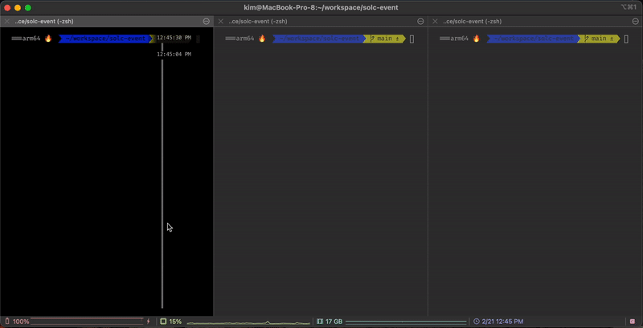

# solc-event
solidity event example

install package 

    npm i
    cd contracts
    npm i

run ganache blockchain

    cd contracts
    npm run testrpc
    

run code

    npm start
    
call contract. 
num and addrInd are option.

    npm run call <num> <addrInd>
    
  
    
to see num

    npm run get

